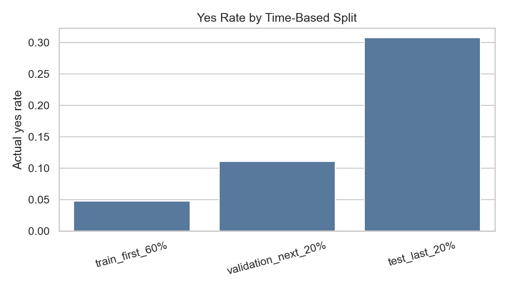
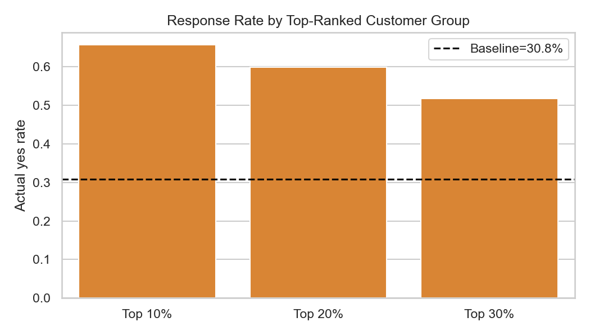

# Bank Marketing 数据分析项目

这是一个基于 UCI Bank Marketing 数据集的银行电话营销分析项目，目标是预测客户是否会认购定期存款，并进一步把模型结果转化为可执行的营销名单策略。

项目不仅做了常规的二分类建模，还额外加入了更贴近真实业务的时间切分验证和客户分层收益分析，用来回答两个更实用的问题：

1. 模型在“用过去预测未来”的场景下是否依然稳定。
2. 如果营销资源有限，应该优先联系哪些客户。

## 项目背景

原始数据来自银行电话营销活动记录，标签变量是 `y`：

- `yes`：客户认购了定期存款
- `no`：客户未认购

这是一个典型的二分类且类别不平衡问题。项目中特别注意了一个关键的业务约束：`duration` 表示通话时长，它只会在电话结束后才知道，因此不能用于真实营销前预测，否则会造成信息泄漏。

## 数据文件

- `bank-additional-full.csv`：主数据文件，包含客户属性、历史营销信息和宏观经济变量。
- `bank-additional-names.txt`：字段说明文件。

## 核心亮点

- 采用 LightGBM 作为主模型，并做了参数调优。
- 明确排除了 `duration`，避免把事后信息带入模型。
- 保留宏观经济变量，因为它们在营销时点通常可知，而且实验结果显示对模型有帮助。
- 使用训练集、验证集、测试集分离的方式评估模型，避免在测试集上反复调参。
- 进一步加入时间切分验证，模拟真实上线时“用过去预测未来”的场景。
- 通过 Top 10%、Top 20%、Top 30% 客户分层分析，把模型输出转成营销名单优先级。

## 主要结果

### 随机切分下的推荐模型

- 模型：LightGBM Tuned
- 测试集 PR-AUC：0.4923
- 测试集 ROC-AUC：0.8185
- `yes` precision：0.4851
- `yes` recall：0.5970
- `yes` F1：0.5353

### 时间切分下的真实场景验证

- 时间测试集 PR-AUC：0.2898
- 时间测试集 ROC-AUC：0.4352
- `yes` precision：0.2651
- `yes` recall：0.5425
- `yes` F1：0.3562

这说明模型在随机切分下表现不错，但面对未来数据会明显变难，存在时间分布漂移。



### 客户排序和分层收益

未来客户排序中，推荐模型为 `No Macro Future Ranking Model`。在时间测试集上的 Top 客户分层结果如下：

- Top 10% 客户认购率：65.66%，约为整体未来样本的 2.13 倍
- Top 20% 客户认购率：59.89%，约为整体未来样本的 1.94 倍
- Top 30% 客户认购率：51.78%，约为整体未来样本的 1.68 倍

这部分结果更适合直接转化为营销名单优先级。



## 文件结构

- `bank-marketing.ipynb`：原始分析 notebook。
- `bank-marketing-beginner-tuned.ipynb`：新手友好版主 notebook，包含完整建模、调优、时间切分和分层分析。
- `append_time_split_and_lift_analysis.py`：把时间切分和 Lift 分析追加到 notebook 的脚本。
- `update_top_lift_to_future_ranking.py`：更新未来客户排序和 Lift 逻辑的脚本。
- `make_beginner_tuned_notebook.py`：生成新手友好版 notebook 的脚本。
- `bank-marketing-tuning-summary.md`：调优总结与实验结论。
- `bank-marketing-optimization-log.md`：优化日志，记录后续追加的时间切分和排序分析结果。
- `figures_beginner/`：运行 notebook 后生成的图表目录。

## 快速开始

### 1. 安装依赖

建议使用 Python 3.10+，然后安装以下包：

```bash
pip install pandas numpy scikit-learn lightgbm matplotlib seaborn jupyter nbformat
```

### 2. 打开 notebook

直接运行 [bank-marketing-beginner-tuned.ipynb](bank-marketing-beginner-tuned.ipynb)，按顺序执行所有单元格即可。

### 3. 运行脚本生成 notebook 或分析结果

如果你想重新生成 notebook 或更新分析内容，可以运行这些脚本：

```bash
python make_beginner_tuned_notebook.py
python append_time_split_and_lift_analysis.py
python update_top_lift_to_future_ranking.py
```

## 输出内容

运行 notebook 后会生成或更新：

- `figures_beginner/time_split_yes_rate.png`
- `figures_beginner/top_customer_lift_time_holdout.png`
- `bank-marketing-optimization-log.md`

你也可以直接在 README 中查看关键结果图：


## 如何理解这份分析

如果只看随机切分结果，这个模型看起来已经有不错的区分能力；但从业务角度，更重要的是它能不能在未来客户上稳定工作。这个项目的结论是：

- 直接分类可以帮助理解模型能力。
- 时间切分更接近真实上线场景。
- 客户排序和分层更适合用于实际营销执行。

